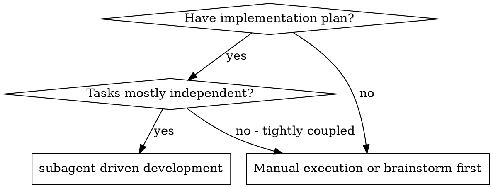
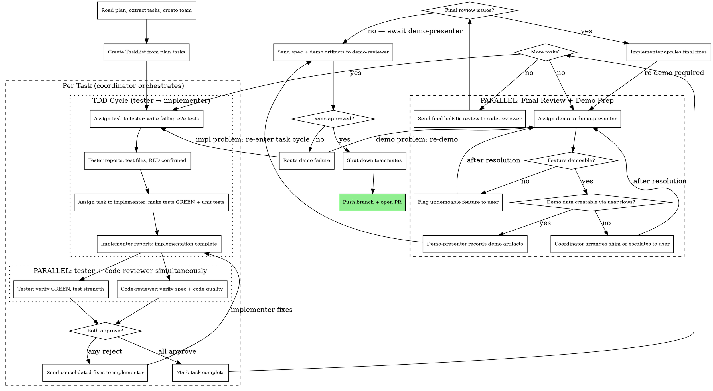

# Subagent-Driven Development

Execute plan by creating an agent team: you are the coordinator, teammates handle implementation, testing, review, and demo. Teammates persist across rounds so they keep context during fix cycles.

**Core principle:** You coordinate. Teammates implement, test, review, and demo. Nobody works alone — every change gets adversarial testing AND review (spec compliance + code quality in one pass). Fix cycles go directly between you and the teammates, no context lost.

**IMPORTANT:** This skill requires `CLAUDE_CODE_EXPERIMENTAL_AGENT_TEAMS`. Use the TeamCreate, Task (with `team_name`), SendMessage, TaskCreate/TaskUpdate/TaskList tools. Do NOT use background Task subagents — use persistent teammates instead.

## When to Use



## Team Structure

Create a team with five teammates. You (the coordinator) never implement — you orchestrate.

| Role | subagent_type | Purpose |
|------|---------------|---------|
| **You** (coordinator) | — | Read plan, create tasks, assign work, mediate fix cycles, maximize parallelism |
| **implementer** | `general-purpose` | Implements tasks, writes unit tests, makes tester's e2e tests pass |
| **tester** | `general-purpose` | Writes adversarial e2e/integration tests (RED), verifies GREEN is genuine |
| **code-reviewer** | `general-purpose` | Verifies spec compliance AND reviews code quality, maintainability, patterns |
| **demo-presenter** | `general-purpose` | Demos completed feature manually, records artifacts |
| **demo-reviewer** | `general-purpose` | Reviews spec + demo as strict client CEO (no code access) |

## Parallelism Principle

**Run agents in parallel whenever there are no data dependencies between them.** Sequential handoffs are only required when one agent's output is another's input. The coordinator must maximize concurrency at every stage.

## The Process



## Step-by-Step

### Step 1: Setup

1. Read plan file, extract all tasks with full text
2. Create team:
   ```
   TeamCreate: team_name="plan-execution", description="Executing [plan name]"
   ```
3. Spawn five teammates (all `general-purpose`, use `team_name="plan-execution"`):
   - **tester** — see `./tester-prompt.md` for spawn prompt
   - **implementer** — see `./implementer-prompt.md` for spawn prompt
   - **code-reviewer** — see `./code-reviewer-prompt.md` for spawn prompt
   - **demo-presenter** — see `./demo-presenter-prompt.md` for spawn prompt
   - **demo-reviewer** — see `./demo-reviewer-prompt.md` for spawn prompt
4. Create TaskList entries for all plan tasks using TaskCreate

### Step 2: Per-Task Cycle

For each task in order:

**2a. TDD RED — Assign to tester**
- Mark task `in_progress` via TaskUpdate
- SendMessage to **tester** with:
  - Full task text from plan (never make them read the plan file)
  - Context: where this fits, dependencies, architectural notes
  - Instruction: write e2e/integration tests, confirm RED, report back

**2b. Wait for tester report**
- Tester messages back with: test file paths, test names, failure output (RED confirmed)
- If tester asks questions: answer via SendMessage, let them continue
- If tester requests a spec clarification on a public API or data contract:
  - Forward the question to the **implementer** asking them to document the
    answer in the spec (not just reply verbally)
  - Once spec is updated, notify the tester to re-read it and continue

**2c. TDD GREEN — Assign to implementer**
- SendMessage to **implementer** with:
  - Full task text from plan
  - Context
  - Tester's test file paths and test names
  - Instruction: make tester's tests GREEN, write unit tests, commit, self-review, report

**2d. Wait for implementer report**
- Implementer messages back with: what they built, test results, files changed, concerns
- If implementer asks questions: answer via SendMessage, let them continue
- If implementer reports a spec bug:
  - **Minor / unambiguous** (e.g., typo, obvious omission with clear intent):
    authorize the implementer to patch the spec and continue
  - **Significant / ambiguous** (e.g., contradictory requirements, unclear
    behavior): pause the task and escalate to the user for clarification
    before the implementer proceeds

**2e. PARALLEL review — Send both at once**

After implementer reports, send review requests to **both simultaneously**:

1. SendMessage to **tester**: verify GREEN (tests pass? assertions intact? strength assessment?)
2. SendMessage to **code-reviewer**: verify spec compliance + code quality (read actual code + git diff, not just report)

These two have no data dependency on each other — run them in parallel.

**2f. Collect results and handle**
- If **both approve** → mark task complete via TaskUpdate, proceed to next task
- If **either rejects** → send consolidated fix list to **implementer**, wait for fixes, then **re-send to both reviewers again** (any implementation change invalidates all prior approvals)

**Safety valve:** max 3 full review cycles per task. If after 3 cycles either reviewer is still not satisfied, escalate to user.

### Step 3: Final Review + Demo Prep (parallel)

After all tasks complete, send **both simultaneously** — no dependency between them:

1. SendMessage to **code-reviewer**: review the entire implementation holistically
2. SendMessage to **demo-presenter**: demo assignment (spec, completed tasks, demo plan)

**Handle demo-presenter demoability** (while awaiting code-reviewer):
- If feature is demoable: demo-presenter executes and records demo artifacts
- If demo-presenter **cannot create demo data through user flows**: coordinator must resolve:
  - Decide whether the implementer/tester should create a testing shim
    (a lightweight, temporary feature kept until the real feature lands)
  - OR escalate to the user for help creating demo data
  - Once resolved, provide the demo-presenter with instructions and re-assign
- If feature is **NOT demoable at all**: demo-presenter reports WHY → coordinator must resolve:
  - Pull UI/frontend forward from future features
  - Have implementer create a testing shim (coordinator decides scope)
  - Escalate to user if spec changes are needed
  - After resolution, re-assign to demo-presenter
- **Demo-presenter must NEVER create mocks, shims, route interception, or test
  harnesses themselves** — all such infrastructure goes through the coordinator
  to the implementer/tester

**Handle code-reviewer final report**:
- If **no issues**: wait for demo-presenter artifacts, then proceed to demo-reviewer
- If **issues found**: send fixes to implementer → after implementer fixes, re-assign demo-presenter (demo is stale) → once both done, proceed to demo-reviewer

**Any implementation change invalidates the demo. Always re-demo after implementation fixes.**

### Step 4: Demo Review

Once both code-reviewer approves AND demo-presenter has recorded artifacts:

- SendMessage to **demo-reviewer** with:
  - Full spec/requirements (NO implementation code)
  - Demo artifacts from demo-presenter
  - Instruction: review as strict client CEO

**Handle demo review result**:
- If **approved** → proceed to shutdown
- If **rejected**:
  - Demo execution problem (sloppy, incomplete walkthrough) → back to demo-presenter for re-demo → demo-reviewer re-reviews
  - Implementation problem (feature buggy, incomplete) → back to implementer, re-enters full task cycle (tester → implementer → parallel review) → then re-demo + re-review from scratch
  - Spec problem → coordinator flags to user → after spec change, re-enter task cycle for affected tasks → then re-demo + re-review from scratch

### Step 5: Shutdown and Ship

1. Send `shutdown_request` to all five teammates
2. Wait for shutdown confirmations
3. Push branch and open PR immediately — no prompting:
   ```bash
   git push -u origin <feature-branch>
   gh pr create --title "<title>" --body "$(cat <<'EOF'
   ## Summary
   <2-3 bullets of what changed>

   ## Test Plan
   - [ ] <verification steps>
   EOF
   )"
   ```
4. Report the PR URL to the user

## Prompt Templates

- `./tester-prompt.md` — Spawn prompt and message templates for adversarial tester
- `./implementer-prompt.md` — Spawn prompt and message templates for implementer
- `./code-reviewer-prompt.md` — Spawn prompt and message templates for code reviewer (spec + quality)
- `./demo-presenter-prompt.md` — Spawn prompt and message templates for demo presenter
- `./demo-reviewer-prompt.md` — Spawn prompt and message templates for demo reviewer

## Example Workflow

```
Coordinator: I'm using Subagent-Driven Development to execute this plan.

[Read plan file: docs/plans/feature-plan.md]
[Extract all 3 tasks with full text and context]

[TeamCreate: team_name="plan-execution"]
[Spawn tester, implementer, code-reviewer, demo-presenter, demo-reviewer]
[TaskCreate for all 3 tasks]

--- Task 1: User registration form ---

[SendMessage to tester: full task text + context]

Tester: "Tests written:
  - test_registration_happy_path: fills form, submits, verifies redirect to dashboard + welcome email
  - test_registration_duplicate_email: registers, tries again with same email, verifies error message
  - test_registration_weak_password: tries weak password, verifies rejection with specific message
  - test_registration_empty_fields: submits empty form, verifies all required field errors shown
  All 4 tests FAIL (RED confirmed). Test files: tests/e2e/test_registration.py"

[SendMessage to implementer: task text + tester's test files]

Implementer: "Implemented registration form + validation + persistence.
  All e2e tests pass. Wrote 6 unit tests for validation logic. Committed."

[PARALLEL: SendMessage to tester, code-reviewer simultaneously]

Tester: "All 4 tests pass. BUT implementer nailed it first try — suspicious.
  Writing additional adversarial tests:
  - test_registration_sql_injection: tries SQL in email field
  - test_registration_xss_in_name: tries script tags in name field
  Both new tests FAIL (RED). Reporting new RED to coordinator."

[SendMessage to implementer: "Tester found new RED — SQL injection and XSS tests. Make them GREEN."]

Implementer: "Fixed. Added input sanitization. Both new tests pass. Committed."

[Meanwhile, code-reviewer already reported:]

Code reviewer: "## Spec Compliance
  ✅ Compliant — all requirements met.
  ## Code Quality
  Issues (Important): Password validation logic duplicated in frontend and
  backend. Extract shared validation. Otherwise approved."

[SendMessage to implementer: consolidated fixes — code reviewer's duplication issue]

Implementer: "Extracted shared validation module. Committed."

[PARALLEL: Re-send to BOTH (implementation changed, both must re-review)]

Tester: "All 6 tests pass. Assertions intact. Adversarial tests pass. ✅"
Code reviewer: "## Spec Compliance ✅  ## Code Quality ✅ Duplication resolved. Approved."

[TaskUpdate: mark Task 1 complete]

--- Task 2: Login flow --- [similar cycle] ---
--- Task 3: Password reset --- [similar cycle] ---

--- Final holistic review + demo prep (parallel) ---

[PARALLEL: SendMessage to code-reviewer: "Final review of entire auth system"
           SendMessage to demo-presenter: spec + completed tasks]

Code reviewer: "Consistent patterns, good test coverage, approved."

Demo-presenter: "Demo plan (devised — not in spec):
  1. Register new user with valid details
  2. Log out
  3. Log in with those credentials
  4. Request password reset
  5. Follow reset link, set new password
  6. Log in with new password
  7. Try registering with duplicate email (error case)

  Executed full demo via Playwright manual steps. Recorded step-by-step
  screenshots. Saved to spec/demo/2026-02-17-auth-system/

  Observations: reset email link takes 3 seconds to appear — might
  feel slow to users but functional."

[SendMessage to demo-reviewer: spec + demo artifacts (NO code)]

Demo-reviewer: "REJECTED.
  - Registration demo looks good ✅
  - Login works ✅
  - Password reset: demo shows clicking the link but NOT the actual
    'set new password' form. Was it skipped? Requirement says 'user
    enters new password with confirmation field' — this was not shown.
  - No error cases shown for login (wrong password, locked account)"

[SendMessage to demo-presenter: "Re-demo. Show the full password reset form
  and add login error cases (wrong password)."]

Demo-presenter: "Re-demoed with complete password reset flow and login errors.
  Updated screenshots saved to spec/demo/2026-02-17-auth-system/"

[SendMessage to demo-reviewer: "Re-review with updated artifacts"]

Demo-reviewer: "✅ APPROVED. All requirements demonstrated. Password reset
  form shown in full. Error cases covered."

[shutdown_request to all teammates]
[git push -u origin feature-branch]
[gh pr create → PR URL reported to user]

Done!
```

## Why Teams Over Background Tasks

| | Background Tasks | Agent Teams |
|---|---|---|
| **Context across fix rounds** | Lost — each dispatch starts fresh | Kept — teammate remembers prior work |
| **Fix cycles** | Re-explain everything each round | Just say "fix X" — they know the context |
| **Coordination** | One-shot fire-and-forget | Persistent back-and-forth messaging |
| **Reviewer context** | Re-reads code from scratch each time | Already knows what to look for |
| **Parallel reviews** | Must dispatch sequentially or manage separate tasks | Send three messages at once, collect results |
| **Cost** | New context per dispatch | Amortized — fewer tokens over multiple rounds |

## Red Flags

**Never:**
- Start implementation on main/master branch without explicit user consent
- Implement code yourself — you are the coordinator, delegate everything
- Skip reviews (tester verification OR code-reviewer spec+quality check)
- Proceed with unfixed issues
- Let implementer write e2e/integration tests (that is the tester's job)
- Skip tester verification of GREEN (implementer may have weakened assertions)
- If implementer nails it first try, accept without asking tester to strengthen tests
- Run reviews sequentially when they can run in parallel
- **Any implementation change invalidates ALL prior approvals** — both reviewers must re-review
- **Any implementation change after demo invalidates the demo** — must re-demo and re-review from scratch
- Skip the demo gate
- Let demo-presenter use automated test scripts (must be manual user emulation)
- Let demo-presenter inject mocking logic, route interception, or request stubs into Playwright or any tool
- Let demo-presenter implement testing shims or testability harnesses — only implementer/tester create shims, coordinated through you
- Let demo-presenter create demo data through anything other than normal user flows (UI, documented CLI, public APIs) — if they can't, they must escalate to you
- Give demo-reviewer access to implementation code
- Accept "feature can't be demoed" without investigating — this is a design smell
- Skip scene-setting context (teammates need to understand where task fits)
- Accept "close enough" on spec compliance
- Let implementer self-review replace actual review (both are needed)
- **Start code review before implementer reports GREEN** — code-reviewer and tester review in parallel after implementer's report, not before
- Move to next task while either reviewer has open issues

**If implementer asks questions:**
- Answer clearly and completely via SendMessage
- Provide additional context if needed
- Don't rush them into implementation

**If any reviewer finds issues:**
- Consolidate all rejection feedback into one message to implementer
- Wait for implementer to fix and report back
- Re-send to BOTH reviewers (implementation changed)
- Repeat until both approve

**If implementer is stuck:**
- Help them via SendMessage with guidance
- Don't take over implementation yourself

**If demo-reviewer rejects:**
- Classify the failure: demo problem, implementation problem, or spec problem
- Route to the right teammate or escalate to user
- After any implementation fix: re-demo and re-review from scratch

## Integration

**Required workflow skills:**
- **superpowers:using-git-worktrees** - REQUIRED: Set up isolated workspace before starting
- **superpowers:writing-plans** - Creates the plan this skill executes
- **superpowers:requesting-code-review** - Code review template for reviewer teammates

**Teammates should use:**
- **superpowers:test-driven-development** - Tester and implementer follow TDD
